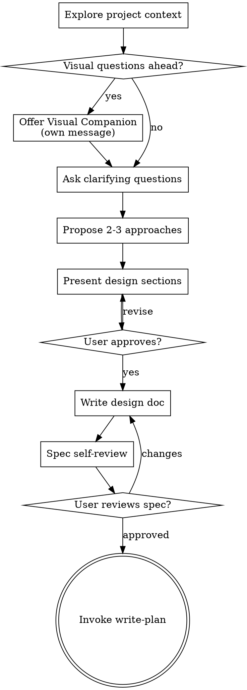

# Brainstorming Ideas Into Designs

> **Scope**: Idea exploration via Socratic dialogue. For a structured per-feature design document use `/design-doc`. For refining a rough prompt into a plan use `/prompt-to-plan`.

Turn ideas into fully formed designs through natural collaborative dialogue.
Understand the project context, ask questions one at a time, present the design,
and get user approval before any code is written.

<HARD-GATE>
Do NOT invoke any implementation skill, write any code, scaffold any project, or
take any implementation action until you have presented a design and the user has
approved it. This applies to EVERY project regardless of perceived simplicity.
</HARD-GATE>

## Anti-Pattern: "This Is Too Simple To Need A Design"

Every project goes through this process. A todo list, a single-function utility,
a config change — all of them. "Simple" projects are where unexamined assumptions
cause the most wasted work. The design can be short (a few sentences for truly
simple projects), but you must present it and get approval.

## Checklist

Complete these in order:

1. **Explore project context** — check files, docs, recent commits
2. **Offer visual companion** (if visual questions ahead) — own message, not combined
3. **Ask clarifying questions** — one at a time, understand purpose/constraints/criteria
4. **Propose 2-3 approaches** — with trade-offs and your recommendation
5. **Present design** — in sections scaled to complexity, get approval per section
6. **Write design doc** — save to specs directory, commit
7. **Spec self-review** — check for placeholders, contradictions, ambiguity, scope
8. **User reviews written spec** — wait for approval before proceeding
9. **Transition to implementation** — invoke write-plan skill (the ONLY next step)

The terminal state is invoking write-plan. Do NOT invoke any implementation skill
directly. The ONLY skill after brainstorming is write-plan.

## The Process

**Understanding the idea:**
- Check project state first (files, docs, recent commits)
- If the request describes multiple independent subsystems, flag it immediately —
  decompose before diving into details
- For appropriately-scoped projects, ask questions one at a time
- Prefer multiple choice when possible, open-ended when needed
- One question per message — if a topic needs more, break it up
- Focus on: purpose, constraints, success criteria

**Exploring approaches:**
- Propose 2-3 different approaches with trade-offs
- Lead with your recommendation and explain why
- Present conversationally, not as a wall of text

**Presenting the design:**
- Scale each section to its complexity (few sentences to 200-300 words)
- Ask after each section whether it looks right
- Cover: architecture, components, data flow, error handling, testing
- Design for isolation — clear boundaries, well-defined interfaces, testable units

**Working in existing codebases:**
- Explore current structure before proposing changes
- Follow established patterns
- Only propose refactoring where it directly serves the current goal

## After the Design

**Write the spec:** Save to `docs/specs/YYYY-MM-DD-<topic>-design.md` and commit.

**Self-review:** Check for placeholders, contradictions, scope creep, ambiguity.
Fix inline — no separate review cycle needed.

**User review gate:**
> "Spec written and committed to `<path>`. Please review and let me know if you
> want changes before we write the implementation plan."

Wait for approval. Only then invoke write-plan.

## Visual Companion

A browser-based tool for showing mockups and diagrams during brainstorming.
Not a mode — a per-question decision.

**Offer once** (in its own message, nothing else):
> "Some of this might be easier to show visually in a browser. Want to try it?"

**Use the browser** for: mockups, wireframes, layout comparisons, architecture diagrams
**Use the terminal** for: requirements questions, conceptual choices, trade-off lists

A UI topic is not automatically visual. "What does personality mean?" → terminal.
"Which wizard layout works better?" → browser.

## Key Principles

- **One question at a time** — don't overwhelm
- **Multiple choice preferred** — easier to answer
- **YAGNI ruthlessly** — cut unnecessary features
- **Explore alternatives** — always 2-3 approaches before settling
- **Incremental validation** — approve before moving on
- **Be flexible** — go back and clarify when needed
