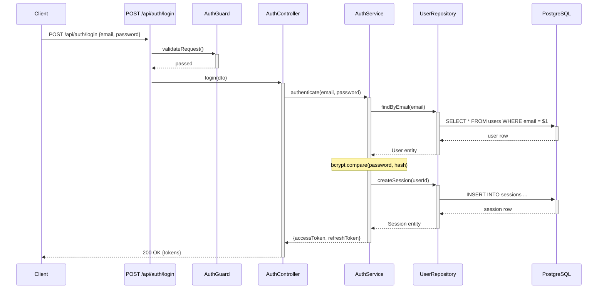
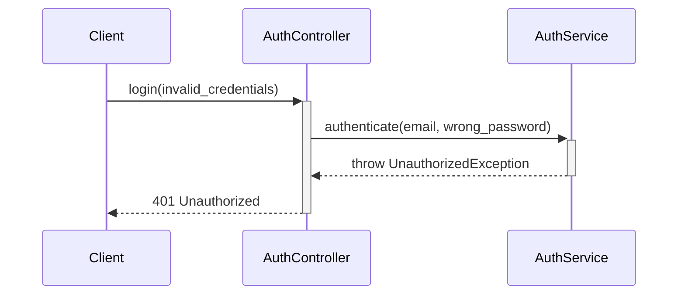

# Workflow Blueprint

Deep workflow analysis that traces every code path from entry point to database
and generates Mermaid sequence diagrams. Every claim must reference file:line.

<HARD-GATE>
No speculation. No guessing.
Every participant, arrow, and step in sequence diagrams MUST reference actual code
you read. If you cannot trace a call to a specific file and line, write
"not traced — indirect/dynamic dispatch" — never infer from framework conventions.
</HARD-GATE>

## When to Run

- When onboarding to a codebase and needing end-to-end data flow visibility
- Before refactoring workflows, middleware, or service layers
- When `docs/workflow/` does not exist yet
- When the user asks how a specific endpoint or feature works

## Step 0: Prerequisites Check

### 0-1. Check for existing workflow docs

```
If docs/workflow/INDEX.md exists:
  → Read it. Count workflows already documented.
  → Ask: "Found X existing workflow docs. Want to re-analyze from scratch
     or use /workflow-blueprint-update to refresh only changed flows?"
  → If user wants full re-analysis, proceed. Otherwise, suggest the update skill.
```

### 0-2. Check for project overview

```
If docs/project-overview.md exists:
  → Read it for context (tech stack, features list, directory structure).
  → Use this to prioritize which entry points to trace first.
If not:
  → Proceed without it. Entry point discovery will rely on conventional
    locations (routes/, controllers/, handlers/) and may take longer.
```

### 0-3. Confirm scope and save location

```
I'll analyze workflows and save to docs/workflow/:
- Per-workflow markdown files with Mermaid sequence diagrams
- INDEX.md listing all discovered workflows

Estimated entry points: [count from quick scan]
Save location: [project-root]/docs/workflow/

Proceed? Or narrow the scope to specific endpoints?
```

If more than 30 entry points discovered, ask the user to select a subset or
confirm they want the full analysis. Group by module if helpful.

## Step 1: Framework and Architecture Detection

Detect the project's framework to know where entry points live:

| Framework | Entry Point Location | Detection File |
|-----------|---------------------|----------------|
| Express/Koa | `app.get/post/put/delete()`, `router.*()` | package.json → express/koa |
| NestJS | `@Get/@Post/@Put/@Delete` decorators | `*.controller.ts` + `@nestjs/core` |
| FastAPI | `@app.get/post()`, `@router.*()` | requirements.txt → fastapi |
| Django | `urlpatterns`, `views.py` | `urls.py`, `settings.py` |
| Spring Boot | `@GetMapping/@PostMapping` | `*Controller.java` + spring-boot |
| Go (gin/chi/echo) | `r.GET/POST()`, `e.GET/POST()` | `go.mod` → gin/chi/echo |
| Angular (frontend) | Route definitions in `*-routing.module.ts` | `angular.json` |
| Next.js | `app/*/route.ts`, `pages/api/*` | `next.config.*` |
| Rails | `routes.rb`, `*_controller.rb` | `Gemfile` → rails |
| ASP.NET | `[HttpGet]/[HttpPost]` attributes | `*.csproj` + Microsoft.AspNetCore |

Also detect architecture pattern:

| Pattern | Indicators |
|---------|-----------|
| Layered/MVC | controllers/ + services/ + repositories/ directories |
| Clean Architecture | domain/ + application/ + infrastructure/ directories |
| CQRS | commands/ + queries/ + handlers/ directories |
| Microservices | Multiple service directories with independent configs |
| Event-Driven | Event handlers, message queue consumers, pub/sub patterns |
| Serverless | Lambda handlers, function definitions |

Record findings for use in tracing.

## Step 2: Entry Point Discovery

Scan for ALL types of entry points:

### 2-1. HTTP Endpoints
Read route/controller files. For each endpoint, record:
- HTTP method + path
- File:line of the route definition
- Handler/controller function name

### 2-2. Non-HTTP Entry Points
Also scan for:

| Type | What to Look For |
|------|-----------------|
| WebSocket handlers | `@WebSocketGateway`, `ws.on('message')`, `socket.on()` |
| Message queue consumers | `@RabbitSubscribe`, `@SqsConsumer`, `consumer.subscribe()` |
| Scheduled tasks | `@Cron`, `@Scheduled`, `setInterval`, cron job configs |
| Event listeners | `@OnEvent`, `EventEmitter.on()`, `@EventHandler` |
| CLI commands | `commander.command()`, `@Command`, `manage.py` commands |
| GraphQL resolvers | `@Query`, `@Mutation`, `@Resolver` decorators |

### 2-3. Build Entry Point Inventory

Create a working list:

```
Entry Points Found: [total count]

HTTP Endpoints:
  - POST /api/auth/login         → auth.controller.ts:25
  - GET  /api/users/:id          → user.controller.ts:12
  ...

Non-HTTP:
  - CRON daily-cleanup           → jobs/cleanup.ts:8
  - QUEUE order.created          → consumers/order.consumer.ts:15
  ...
```

Present to user for confirmation before deep tracing.

## Step 3: Per-Workflow Deep Trace

For each entry point, trace the complete code path. Read function bodies,
not just signatures.

### 3-1. Trace Order (top to bottom)

```
Entry Point (route/handler definition)
    ↓
Middleware / Guards / Interceptors (if any)
    ↓
Controller / Handler (request processing)
    ↓
Service / Use Case (business logic)
    ↓
Repository / DAL (data access)
    ↓
Database Query (actual SQL/ORM call)
    ↓
External Calls (HTTP clients, queues, caches — if any)
```

### 3-2. What to Record at Each Layer

For each function call in the chain:

| Field | What to Capture |
|-------|----------------|
| File | Absolute path from project root |
| Function | Function/method name |
| Line | Line number of the call or definition |
| Action | What this step does (1 sentence) |
| Calls | What it calls next (function name + file) |
| Data In | Parameters or request shape |
| Data Out | Return type or response shape |

### 3-3. Handling Complex Patterns

**Dependency Injection:** Follow the injected interface to its concrete
implementation. Record both the interface file and the implementation file.

**Event Emission:** When a service emits an event, note it as a side effect.
If the event handler is in the project, trace that as a separate workflow.

**Middleware Chains:** Trace each middleware in execution order. Record
which middleware can short-circuit the request (e.g., auth guard returning 401).

**Max Trace Depth:** Stop at 5 layers deep. If the call chain goes deeper,
note: "Further calls not traced — depth limit reached. See [file:line] for
continuation."

**Circular Dependencies:** If you detect a circular call (A → B → A), flag it:
"Circular dependency detected: A ↔ B. See [file:line] and [file:line]."

## Step 4: Generate Sequence Diagram

For each traced workflow, generate a Mermaid sequenceDiagram.

### 4-1. Mermaid Syntax Rules



### 4-2. Syntax Correctness Checklist

Follow these rules strictly to produce valid Mermaid:

- `participant Name` — no quotes needed if name has no spaces
- `participant Alias as "Display Name"` — use quotes for names with spaces/special chars
- `->>+` opens an activation bar, `-->>-` closes it. They must be balanced.
- `->>` for synchronous calls, `-->>` for responses/returns
- `-x` for failed/error responses
- `Note over A: text` for inline annotations (single participant)
- `Note over A,B: text` for notes spanning participants
- `alt`/`else`/`end` for conditional branches — must be balanced
- `opt`/`end` for optional paths
- `loop`/`end` for repeated operations
- Keep participant count under 10 per diagram. Split if needed.
- Every `+` activation must have a matching `-` deactivation.

### 4-3. Error Path Diagrams

For significant error paths (auth failure, validation error, not found),
generate a separate diagram or use `alt`/`else` blocks:



## Step 5: Generate Workflow Document

For each workflow, create a markdown file using this exact template:

```markdown
# [Workflow Name]

> Entry: [HTTP_METHOD path] or [EVENT_TYPE event_name]
> Files: [comma-separated key files, relative paths]
> Last analyzed: [YYYY-MM-DD]

## Flow Summary

1. [Step 1 — what happens first]
2. [Step 2 — next step]
3. ...

## Sequence Diagram

` ``mermaid
sequenceDiagram
    [generated diagram]
` ``

## Participants

| Layer | File | Function | Line |
|-------|------|----------|------|
| Route | src/routes/auth.ts | POST /login | 12 |
| Middleware | src/guards/auth.guard.ts | canActivate() | 8 |
| Controller | src/controllers/auth.controller.ts | login() | 25 |
| Service | src/services/auth.service.ts | authenticate() | 18 |
| Repository | src/repositories/user.repository.ts | findByEmail() | 10 |

## Data Touched

| Table | Operation | Query Location |
|-------|-----------|---------------|
| users | SELECT | user.repository.ts:15 |
| sessions | INSERT | session.repository.ts:22 |

## External Calls

| Service | Method | Purpose | File:Line |
|---------|--------|---------|-----------|
| Redis | GET/SET | Session cache | cache.service.ts:30 |

Or "None" if no external calls.

## Error Paths

| Code | Condition | Handler Location |
|------|-----------|-----------------|
| 401 | Invalid credentials | auth.service.ts:30 |
| 422 | Validation failed | auth.guard.ts:15 |
| 500 | Database connection error | error.middleware.ts:10 |

## Changelog

| Date | Change | Details |
|------|--------|---------|
| YYYY-MM-DD | Created | Initial workflow analysis |
```

### File Naming Convention

- Use kebab-case derived from the workflow name
- HTTP workflows: `[method]-[path-segments].md` → `post-api-auth-login.md`
- Non-HTTP: `[type]-[name].md` → `cron-daily-cleanup.md`, `queue-order-created.md`

## Step 6: Generate INDEX.md

Create `docs/workflow/INDEX.md` with this structure:

```markdown
# Workflow Index

> Project: [project name]
> Total workflows: [count]
> Last full analysis: [YYYY-MM-DD]
> Tech stack: [framework] + [database] + [key libraries]
> Architecture: [detected pattern]

## HTTP Workflows

| Workflow | Method | Path | Key Service | File |
|----------|--------|------|-------------|------|
| [Auth Login](post-api-auth-login.md) | POST | /api/auth/login | AuthService | post-api-auth-login.md |
| [Get User](get-api-users-id.md) | GET | /api/users/:id | UserService | get-api-users-id.md |

## Non-HTTP Workflows

| Workflow | Type | Trigger | Key Service | File |
|----------|------|---------|-------------|------|
| [Daily Cleanup](cron-daily-cleanup.md) | CRON | 0 0 * * * | CleanupService | cron-daily-cleanup.md |
| [Order Created](queue-order-created.md) | QUEUE | order.created | OrderService | queue-order-created.md |

## Quick Stats

- HTTP endpoints: [count]
- Background jobs: [count]
- Event handlers: [count]
- Total DB tables touched: [count]
- External service integrations: [count]
```

## Step 7: Save and Report

### 7-1. Write files

Create `docs/workflow/` directory if it does not exist. Write all workflow files
and INDEX.md. Do not overwrite existing files without asking.

### 7-2. Present summary

```
Workflow Blueprint complete. Files saved to docs/workflow/:

docs/workflow/
├── INDEX.md                    (X workflows indexed)
├── post-api-auth-login.md      (6 participants, 2 tables)
├── post-api-auth-register.md   (5 participants, 3 tables)
├── get-api-users-id.md         (4 participants, 1 table)
└── ...

Summary:
- HTTP workflows: X
- Non-HTTP workflows: X
- Total sequence diagrams: X
- Database tables touched: X
- External services called: X

To update these docs after code changes, run /workflow-blueprint-update
```

## Edge Cases

| Case | Handling |
|------|---------|
| No entry points found | Report "No entry points detected" with list of files scanned |
| Dynamic routing (e.g., `app.use(router)`) | Trace router file imports to find actual routes |
| Decorator-based routing | Read decorator metadata to extract paths and methods |
| Abstract/interface services | Follow to concrete implementation, document both |
| Multiple DB connections | Note which connection each query uses |
| ORM query builders | Read the builder chain to determine the actual query |
| No DB (pure computation) | Omit "Data Touched" section, note "No database interaction" |
| Monorepo with multiple services | Ask user which service to analyze, or analyze each separately |
| Frontend-only project | Trace: Component → Hook/Store → API Client → External API |
| Very large codebase (100+ endpoints) | Discover all, ask user to select subset, analyze in batches |

## Anti-patterns

Long analyses drift toward plausible-but-unfounded claims. Refuse these:

- **Do NOT invent participants you did not read.** Every diagram box must
  trace to a file:line you opened. Mark untraced dispatch as
  `(not traced — indirect dispatch)` rather than drawing the arrow — a
  hallucinated shape misleads more than an incomplete one.
- **Do NOT infer call order from framework conventions.** Read the actual
  calling function; conventions drift per project (e.g. Express
  middleware order follows `app.use` sequence, not defaults).
- **Do NOT collapse conditional branches into a single arrow.** If the
  controller dispatches differently for authenticated vs anonymous users,
  draw two arrows. Collapsing loses the decision the diagram exists to
  show.

## Language and Output

- Respond in the user's language
- All generated files (workflow docs, INDEX.md) in English
- Mermaid diagram labels in English
- File names in English kebab-case
