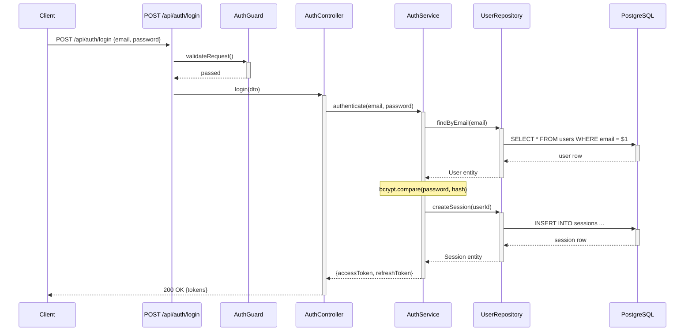
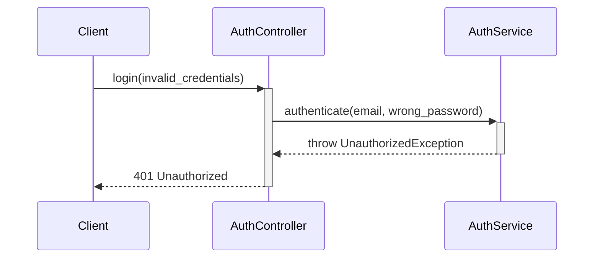

# Mermaid Sequence Diagram Syntax

Reference loaded by `workflow-blueprint` SKILL.md Step 4. Keep diagrams
valid and readable — Claude renders them in-place in the generated workflow
docs.

## Contents

- Full example diagram
- Syntax correctness checklist
- Error-path diagram pattern

## Full example diagram

## Syntax correctness checklist

Follow these rules strictly to produce valid Mermaid:

- `participant Name` — no quotes needed if name has no spaces
- `participant Alias as "Display Name"` — use quotes for names with spaces/special chars
- `->>+` opens an activation bar, `-->>-` closes it. They must be balanced.
- `->>` for synchronous calls, `-->>` for responses/returns
- `-x` for failed/error responses
- `Note over A: text` for inline annotations (single participant)
- `Note over A,B: text` for notes spanning participants
- `alt`/`else`/`end` for conditional branches — must be balanced
- `opt`/`end` for optional paths
- `loop`/`end` for repeated operations
- Keep participant count under 10 per diagram. Split if needed.
- Every `+` activation must have a matching `-` deactivation.

## Error-path diagram pattern

For significant error paths (auth failure, validation error, not found),
generate a separate diagram or use `alt`/`else` blocks:

